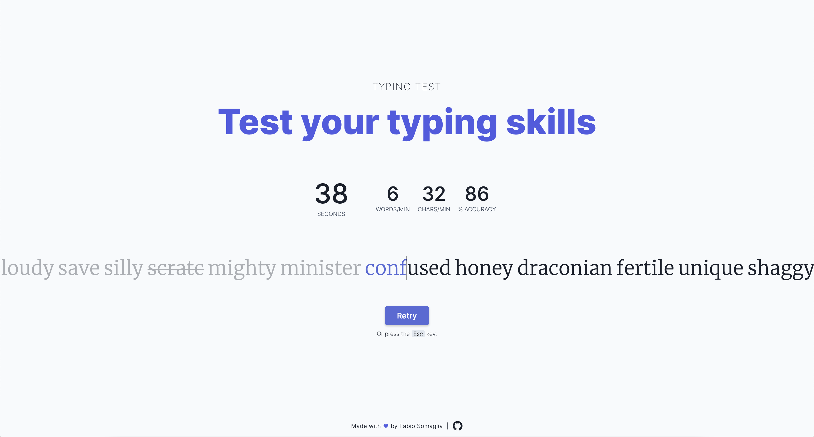

#Typing Test
> A modern web app to test your typing speed



Built with:
- [Angular](https://angular.io)
- [Spring Boot](https://spring.io)

##Getting started
1.  Install the npm packages and build the frontend
    ```bash
    cd frontend/
    npm install
    npm run java:build
    ```
    The `npm run java:build` command builds (compiles TypeScript and copies assets) the application into `backend/src/main/resources/static`.
2.  Run the backend

    There are several ways to run a Spring Boot application on your local machine. One way is to execute the `main` method in the `com.fabiosomaglia.backend.BackendApplication` class from your IDE.

    Alternatively you can use the [Spring Boot Maven plugin](https://docs.spring.io/spring-boot/docs/current/reference/html/build-tool-plugins-maven-plugin.html) like so:

    ```bash
    cd backend/
    mvn spring-boot:run
    ```
    
    The web application is accessible via _localhost:8080_

## Requirements
For building and running the application you need:

- [JDK 11](https://www.oracle.com/java/technologies/javase-downloads.html)
- [Node.js](https://nodejs.org)
- [Maven 3](https://maven.apache.org)
